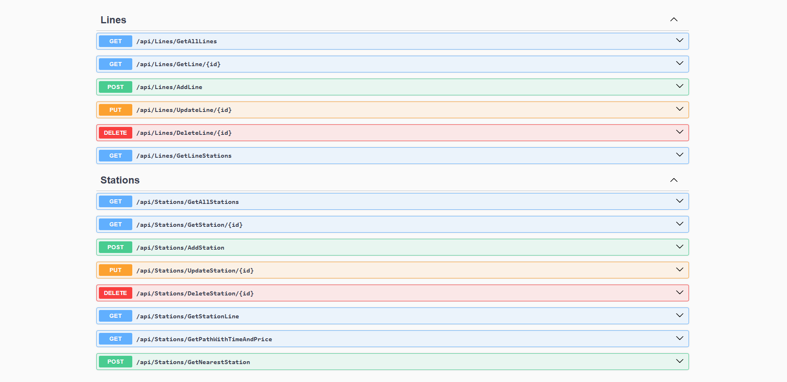

# EgyptMetroAPI

    This API allows users to manage metro lines and stations, retrieve line and station details, find paths with estimated time and
    prices, and identify the nearest station based on location.

# Testing
- Implemented unit tests using **xUnit** to ensure the reliability of the API.
- Covered core business logic, including:
  - Adding and updating lines and stations
  - Calculating nearest stations
  - Get path between two stations
  - Get stations line
  - Ensuring proper validation for input data

# Features

    Lines Endpoints
        GET /api/Lines/GetAllLines: Retrieve all lines.
        GET /api/Lines/GetLine/{id}: Get a specific line by ID.
        POST /api/Lines/AddLine: Add a new line.
        PUT /api/Lines/UpdateLine/{id}: Update an existing line.
        DELETE /api/Lines/DeleteLine/{id}: Delete a line.
        GET /api/Lines/GetLineStations: Get stations in a specific line.

    Stations Endpoints
        GET /api/Stations/GetAllStations: Retrieve all stations.
        GET /api/Stations/GetStation/{id}: Get a specific station by ID.
        POST /api/Stations/AddStation: Add a new station.
        PUT /api/Stations/UpdateStation/{id}: Update a station.
        DELETE /api/Stations/DeleteStation/{id}: Delete a station.
        GET /api/Stations/GetStationLine: Get the line of a specific station.
        GET /api/Stations/GetPathWithTimeAndPrice: Get the path between stations with time and price estimates.
        POST /api/Stations/GetNearestStation: Find the nearest station based on location.

# Technologies Used
    C#
    SQL Server
    .NET
    ASP.Net Core WebAPI

# Image
 
